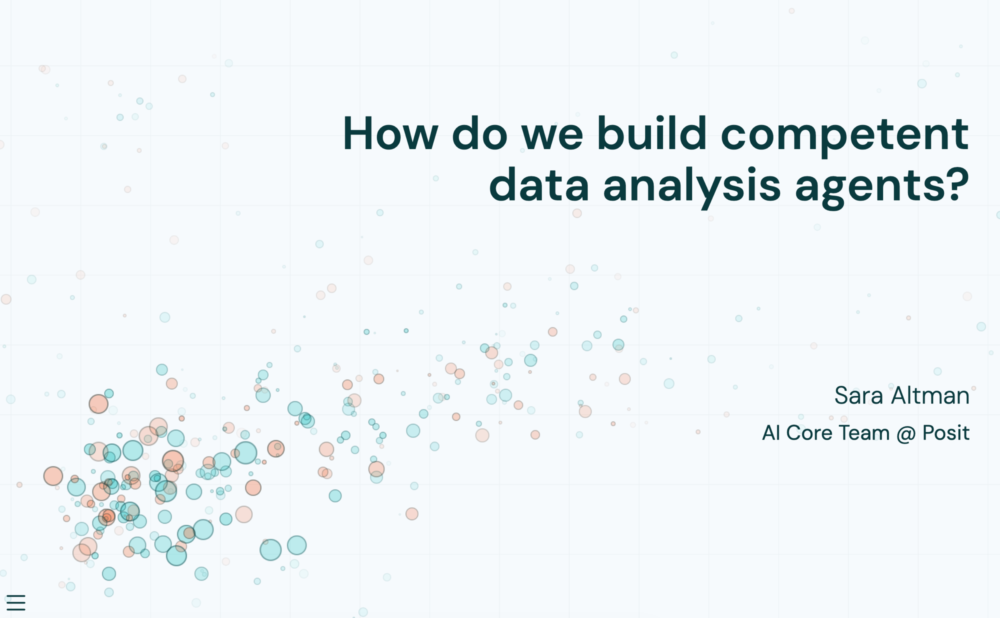

# How do we build competent data analysis agents?

Source code and slides for "Agents for Correct, Transparent, and Reproducible Data Analysis," delivered at a PHUSE SDE. The rendered slides are [here](https://skaltman.github.io/phuse-2026).

Some resources noted in the talk:

* [bluffbench](github.com/posit-dev/bluffbench), an eval measuring whether models will go along with a misleading description of a plot rather than report what they actually see.
* [bluffbench2](github.com/posit-dev/bluffbench2), a follow-up eval to bluffbench that tests a model's ability to spot subtle data quality issues in visualizations.  
* [Posit Assistant](http://pos.it/assistant), a data science coding agent in RStudio and Positron, and the case study for the talk's three design choices: the harness, code as the foundation, and the shape of the interaction.

If you're interested in keeping up with AI news from Posit, we maintain a fortnightly [AI Newsletter](https://opensource.posit.co/tags/ai-newsletter/) on the Posit Open Source Blog.

You can find me here:

|             | Sara Altman                                          |
|-------------|------------------------------------------------------|
| Website     | [saraaltman.com](https://saraaltman.com/)            |
| GitHub      | [skaltman](https://github.com/skaltman)              |
| LinkedIn    | [sarakaltman](https://www.linkedin.com/in/sarakaltman/) |
| BlueSky     | [sara-altman](https://bsky.app/profile/sara-altman.bsky.social) |
