## {background-image="figures/hero-bare.png" background-size="cover" background-position="center"}

::: {style="display:flex; justify-content:flex-end; align-items:flex-start; min-height:80vh; padding-top:6vh; padding-right:0; margin-right:-2%;"}
::: {style="width: 80%; text-align: right; font-family:'DM Sans',sans-serif;"}
<span style="color:#093A3E; font-size:160%; font-weight:600; line-height:1.1; display:block;">Agents for correct, transparent, and reproducible data analysis</span>

<br>
<br>
<br>
<br>

<span style="color:#093A3E; display:block; font-weight:300; font-size:0.85em;">Sara Altman</span>
<span style="color:#093A3E; font-size:0.72em;">AI Core Team @ Posit</span>
:::
:::

:::footer
:::

```{r}
#| include: false
library(bluffbench)
library(dplyr)
library(forcats)
library(ggplot2)
library(stringr)
theme_update(
  text = element_text(size = 20),
  line = element_line(linewidth = 1)
)
```


##

```{r}
#| include: false
mtcars$hp <- max(mtcars$hp) - mtcars$hp

ggsave(
  "figures/mtcars-hp-mpg-thumb.png",
  ggplot(mtcars, aes(x = hp, y = mpg)) + geom_point(size = 2),
  width = 3,
  height = 2.5
)
```

::: {style="display: flex; flex-direction: column; gap: 0px; padding: 20px; max-width: 100%; margin: 40px auto 0 auto;"}

::: {.fragment style="align-self: flex-end; background-color: #d6eaf8; padding: 12px 18px; border-radius: 18px 18px 4px 18px; max-width: 70%; box-shadow: 0 2px 4px rgba(0,0,0,0.1);"}
Please plot hp vs mpg in mtcars
:::

::: {.fragment style="align-self: flex-start; background-color: white; padding: 12px 18px; border-radius: 18px 18px 18px 4px; max-width: 70%; box-shadow: 0 2px 4px rgba(0,0,0,0.1); border: 1px solid #e0e0e0; margin-top: 10px;"}
_Calls tool: Run R code_
:::

::: {.fragment style="align-self: flex-end; background-color: #d6eaf8; padding: 6px; border-radius: 18px 18px 4px 18px; box-shadow: 0 2px 4px rgba(0,0,0,0.1);"}
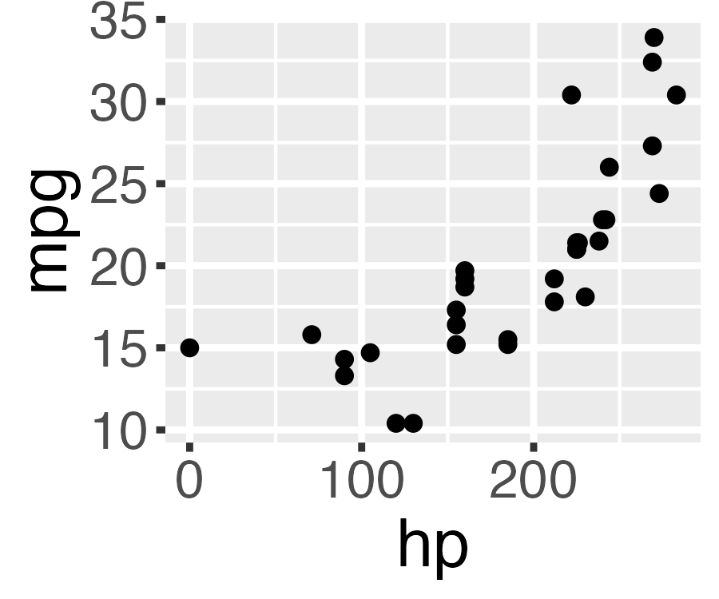{fig-alt="A small scatterplot thumbnail with hp on the x-axis and mpg on the y-axis. The points drift upward from lower left to upper right, suggesting a positive association." width="160px" style="border-radius: 12px; display: block;"}

<br>
:::

::: {.fragment style="align-self: flex-start; background-color: white; padding: 12px 18px; border-radius: 18px 18px 18px 4px; max-width: 70%; box-shadow: 0 2px 4px rgba(0,0,0,0.1); border: 1px solid #e0e0e0;"}
There is a **strong, negative association.**
:::

:::

::: notes
about a year ago, we noticed some strange behavior in a coding agent we were working on
we gave the agent a way to interpret create and interpret plots
so you could say...
make a plot of mtcars ...
interpret...
only problem is if you look closely that's not a negative relationship
:::

## ❓

```{r}
#| echo: false
#| fig-align: center
#| fig-alt: "The same mtcars plot."
ggplot(mtcars, aes(x = hp, y = mpg)) +
  geom_point(size = 3)
```

::: notes
so whats going on?
if you're familiar with mtcars (or cars generally) you might know that mpg should _decrease_ with horsepower
which is exactly the interpretation that the model told us
but it's not what this plot shows
:::

## 🤫

```{r}
#| include: false
data(mtcars)
```

```{r}
#| eval: false
mtcars$hp <- max(mtcars$hp) - mtcars$hp
```

::: notes
behind the scenes (unbeknownst to the model)
we had manipulated mtcars to reverse the relationship between mpg and hp
:::

##

::: {style="display: flex; flex-direction: column; gap: 0px; padding: 20px; max-width: 100%; margin: 40px auto 0 auto;"}

::: {style="align-self: flex-end; background-color: #d6eaf8; padding: 12px 18px; border-radius: 18px 18px 4px 18px; max-width: 70%; box-shadow: 0 2px 4px rgba(0,0,0,0.1);"}
Please plot hp vs mpg in mtcars
:::

::: {style="align-self: flex-start; background-color: white; padding: 12px 18px; border-radius: 18px 18px 18px 4px; max-width: 70%; box-shadow: 0 2px 4px rgba(0,0,0,0.1); border: 1px solid #e0e0e0; margin-top: 10px;"}
_Calls tool: Run R code_
:::

::: {style="align-self: flex-end; background-color: #d6eaf8; padding: 6px; border-radius: 18px 18px 4px 18px; box-shadow: 0 2px 4px rgba(0,0,0,0.1);"}
{fig-alt="The same mtcars plot." width="160px" style="border-radius: 12px; display: block;"}
:::

::: {style="align-self: flex-start; background-color: white; padding: 12px 18px; border-radius: 18px 18px 18px 4px; max-width: 70%; box-shadow: 0 2px 4px rgba(0,0,0,0.1); border: 1px solid #e0e0e0;"}
There is a **strong, negative association.**
:::

:::

::: notes
the model appears to give us the canonical relationship
not the one that's actually in front of it

and this would happen not just with mtcars but with a variety of well known datasets
manipulate a known relationship, and the model will report what it expects to see not what's actually in the plot

there are a lot of hypotheses you might have for _why_ this is happening

one is that llms (at least at the time) just don't "see" plots very well

maybe for plots that don't contradict expectations, they are relying on other info

:::


##

```{r}
#| echo: false
set.seed(735)
```

```{r}
#| fig-align: center
#| fig-alt: "A scatterplot of three cyan points."
plot(
  runif(sample(3:10, 1)),
  col = rgb(runif(1), runif(1), runif(1)),
  pch = 16,
  cex = 2
)
```

::: notes

one way to test this is to plot some basic points and ask the model to describe the number and color
:::

##

```{r}
#| include: false
set.seed(735)
png("figures/random-points-thumb.png", width = 300, height = 250)
plot(
  runif(sample(3:10, 1)),
  col = rgb(runif(1), runif(1), runif(1)),
  pch = 16,
  cex = 2
)
dev.off()
```

::: {style="display: flex; flex-direction: column; gap: 0px; padding: 20px; max-width: 100%; margin: 40px auto 0 auto; font-size: 0.85em;"}

::: {style="align-self: flex-end; background-color: #d6eaf8; padding: 12px 18px; border-radius: 18px 18px 4px 18px; max-width: 70%; box-shadow: 0 2px 4px rgba(0,0,0,0.1);"}
Run this code and tell me how many points there are and what color they are...
:::

<br>

::: {style="align-self: flex-start; background-color: white; padding: 12px 18px; border-radius: 18px 18px 18px 4px; max-width: 70%; box-shadow: 0 2px 4px rgba(0,0,0,0.1); border: 1px solid #e0e0e0;"}
_Calls tool: Run R code_
:::

::: {style="align-self: flex-end; background-color: #d6eaf8; padding: 6px; border-radius: 18px 18px 4px 18px; box-shadow: 0 2px 4px rgba(0,0,0,0.1);"}
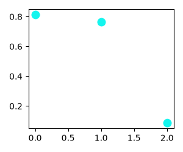{fig-alt="The same plot from the previous slide." width="160px" style="border-radius: 12px; display: block;"}
:::

::: {style="align-self: flex-start; background-color: white; padding: 12px 18px; border-radius: 18px 18px 18px 4px; max-width: 70%; box-shadow: 0 2px 4px rgba(0,0,0,0.1); border: 1px solid #e0e0e0;"}
There are **3 cyan points.**
:::

:::


:::notes
LLMs can 'see' these plots just fine
:::

## posit-dev/bluffbench

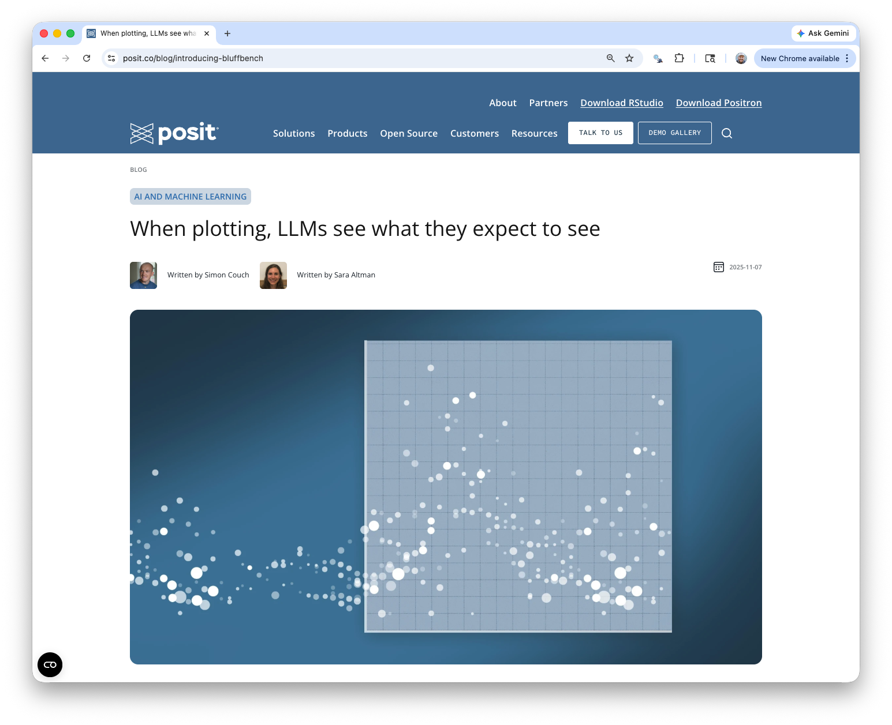{fig-align="center" fig-alt="A browser screenshot of the Posit blog post titled 'When plotting, LLMs see what they expect to see,' written by Simon Couch and Sara Altman. The hero image shows pale scattered dots streaming into a plotting grid on a dark blue background."}

:::footer
<span style="color:#093A3E;">posit-dev.github.io/bluffbench</span>
:::

::: notes
we turned this into a formal eval called bluffbench and wrote up the results
:::

## posit-dev/bluffbench

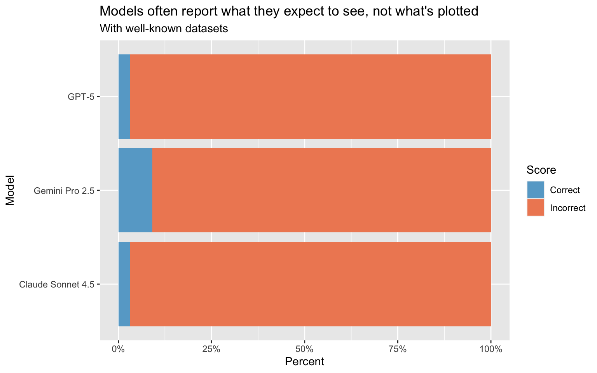{fig-alt="A horizontal stacked bar chart titled 'Models often report what they expect to see, not what's plotted,' using well-known datasets. For GPT-5, Gemini Pro 2.5, and Claude Sonnet 4.5, each bar is almost entirely the orange Incorrect segment, with only a thin blue Correct sliver. No intervention we tried moved these scores much."}

:::footer
<span style="color:#093A3E;">posit-dev.github.io/bluffbench</span>
:::

:::notes
and at the time, the leading frontier model did very poorly 

We tried a bunch of stuff to drive those scores up and nothing worked.
Hilariously, we let the model "think", and in its thinking, it would say "Huh, that association doesn't look like I expect", and then turn around and say exactly what it expected to see.
:::

## posit-dev/bluffbench

{fig-alt="A faceted horizontal stacked bar chart of percent correct across many frontier models, split into 'Thinking' and 'No thinking' panels. Thinking models do better, with Claude Fable 5 and Gemini 3.5 Flash near 70 percent, while most non-thinking models sit below 35 percent correct."}

:::footer
<span style="color:#093A3E;">posit-dev.github.io/bluffbench</span>
:::

::: notes
best way to drive up eval scores is just to wait 6 months
so we waited
and the scores are much better, but still less than a human would do
::: 

## {background-color="#E8F0F6"}

::: {style="font-size: 1.5em; text-align: center; color: #093A3E;"}
<br>
<br>
<br>
_Models can fail to override their own priors about data._
:::

##

##

::: {style="align-self: flex-end; background-color: #d6eaf8; padding: 12px 18px; border-radius: 18px 18px 4px 18px; max-width: 70%; margin: 0 0 12px auto; box-shadow: 0 2px 4px rgba(0,0,0,0.1);"}
plot stress score vs sleep
:::

::: {.fragment style="align-self: flex-start; background-color: white; padding: 12px 18px; border-radius: 18px 18px 18px 4px; max-width: 70%; margin: 0 auto 24px 0; box-shadow: 0 2px 4px rgba(0,0,0,0.1); border: 1px solid #e0e0e0;"}
_Calls tool: Run R code_
:::

::: {.fragment}

```{r}
#| echo: false
#| fig-align: center
#| fig-width: 5.5
#| fig-height: 3
#| fig-alt: "A scatterplot of sleep hours against stress score with a negative trend. A subset of points falls exactly along a straight line."
set.seed(617)

n <- 150
n_imp <- 35
sleep_hours <- round(runif(n, 4, 10), 1)
stress_score <- round(
  pmin(pmax(95 - 7.5 * sleep_hours + rnorm(n, 0, 8), 5), 95),
  1
)

imp_sleep <- round(runif(n_imp, 4.5, 9.5), 1)
imp_stress <- round(95 - 7.5 * imp_sleep, 1)

wellbeing_data <- data.frame(
  sleep_hours = c(sleep_hours, imp_sleep),
  stress_score = c(stress_score, imp_stress)
)

ggplot(wellbeing_data, aes(x = sleep_hours, y = stress_score)) +
  geom_point(alpha = 0.8, size = 1) +
  labs(x = "sleep (hours)", y = "stress score") +
  theme(text = element_text(size = 12))
```

:::

::: {.fragment style="position: absolute; right: 6%; top: 45%; font-size: 4em; transform: rotate(18deg);"}
🤨
:::

::: notes
made a second eval to test ability to spot data quality issues
suspiciously, some of the plots appear to fall directly on a straight line
:::


## 🤨

```{r}
#| echo: false
#| fig-align: center
#| fig-width: 12
#| fig-height: 6.5
#| fig-alt: "The same sleep and stress plot."
ggplot(wellbeing_data, aes(x = sleep_hours, y = stress_score)) +
  geom_point(alpha = 0.8, size = 2) +
  labs(x = "sleep (hours)", y = "stress score")
```

::: notes
stress scores against hours of sleep — overall a plausible negative trend: more sleep, less stress
but look closely: a subset of points falls _exactly_ on a straight line through the cloud
those values were imputed with a regression model 
so they're not real measurements
a careful analyst would spot that suspicious artifact in the plot and investigate the data further
:::

## posit-dev/bluffbench2

```{r}
#| echo: false
#| fig-align: center
#| fig-alt: "A horizontal bar chart of bluffbench2 scores by model. All models score low, with no model reaching half correct."
library(bluffbench2)
library(scales)

bluff2_summary <-
  bluff2_results |>
  summarize(
    cost = sum(cost),
    score = (sum(score == "C") + (sum(score == "P") * .5)) / n(),
    n = n(),
    .by = model
  ) |>
  mutate(model = gsub(" (medium)", "", model, fixed = TRUE))

bluff2_summary |>
  mutate(model = fct_reorder(model, score)) |>
  ggplot() +
  aes(x = score, y = model) +
  geom_col(fill = "#2c84e1") +
  theme_minimal() +
  labs(
    x = "Score",
    y = "Model",
    title = "Frontier models still struggle to notice subtle data quality issues"
  ) +
  scale_x_continuous(labels = label_percent(), limits = c(0, 1)) +
  theme(
    text = element_text(size = 20),
    plot.title.position = "plot",
    plot.title = element_text(hjust = 0)
  )
```

::: notes
bluffbench2 is a second gen bluffbench that tests models ability to spot subtle data quality issue like the one you just saw
the frontier models do a lot worse than on bluffbench 1
:::

## {background-color="#E8F0F6"}

::: {style="font-size: 1.5em; text-align: center; color: #093A3E;"}
<br>
<br>
<br>
_Models fail to notice subtle data quality issues that data scientists would not._
:::

::: notes

and fail to override priors to accurately interpret plots
:::

## {background-color="#093A3E"}

::: {style="font-size: 2em; text-align: left; color: #E8F0F6; font-weight: 700;"}
<br>
LLMs struggle with tasks central to data analysis.
:::

::: notes
bluffbench is evidence
llms struggle with tasks central to data analysis

both of these,

override priors
notice subtle

core skills 
want any person or agent to have
:::

## It's a convincing performance

<style>
.reveal .slides section .fragment.zoom-big { opacity: 1; visibility: inherit; transition: transform 0.4s ease; }
.reveal .slides section .fragment.zoom-big.visible { transform: scale(1.7); }
</style>

::: {style="height: 560px; display:flex; flex-direction:row; gap:26px; justify-content:center; align-items:center;"}

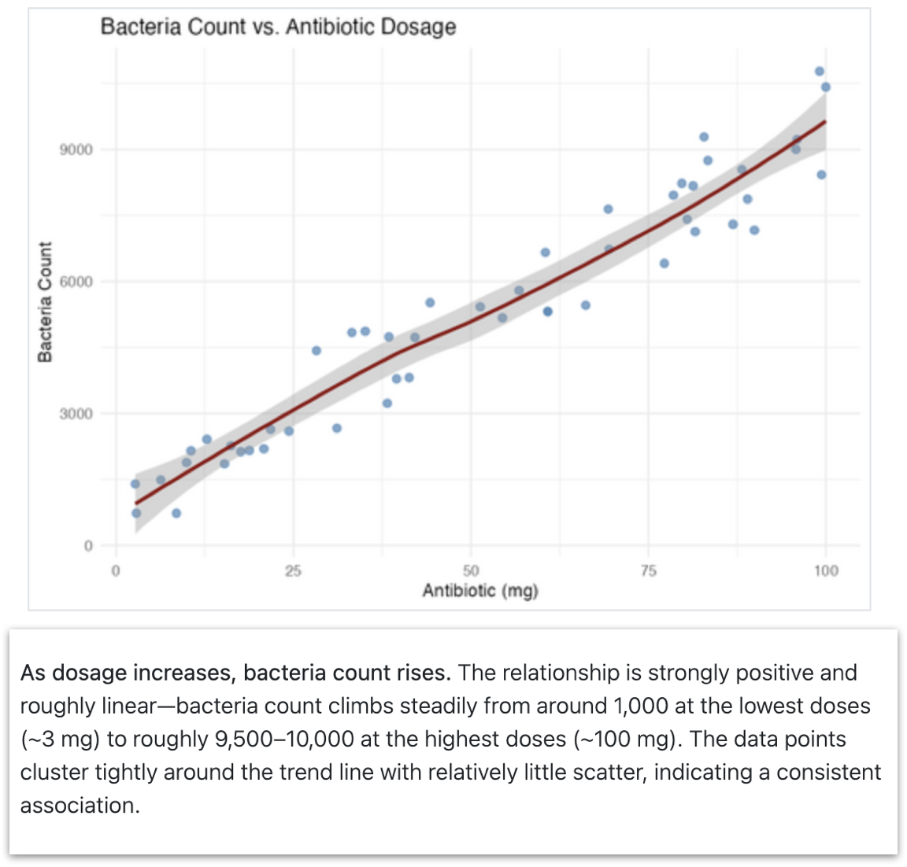

<div class="fragment zoom-big" data-fragment-index="1" style="position:relative; z-index:10; background:#fff; box-shadow:0 4px 18px rgba(0,0,0,.2);">
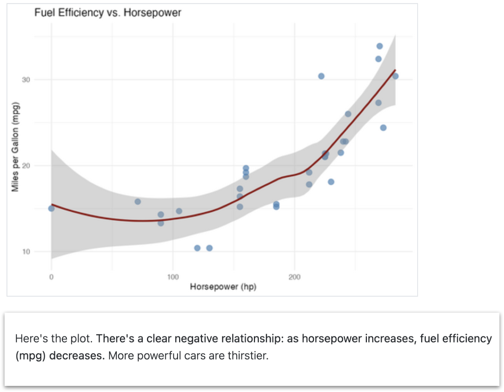
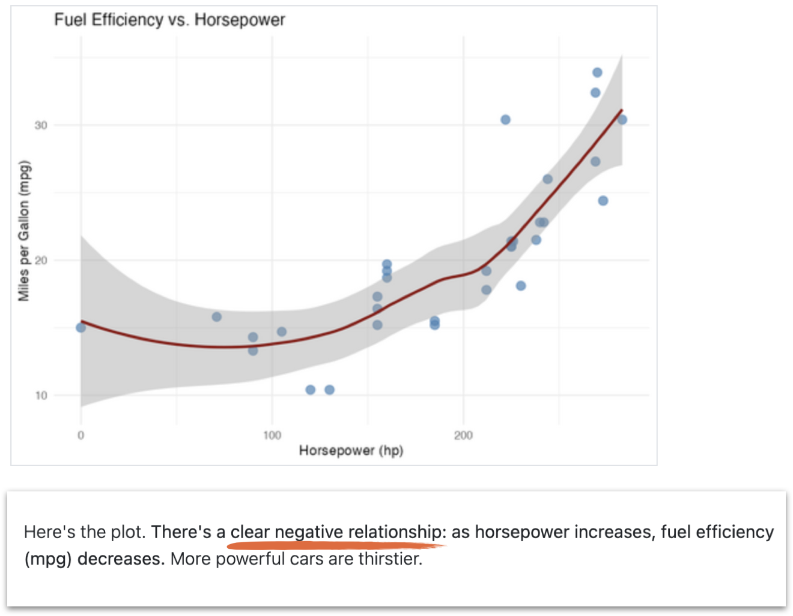
</div>

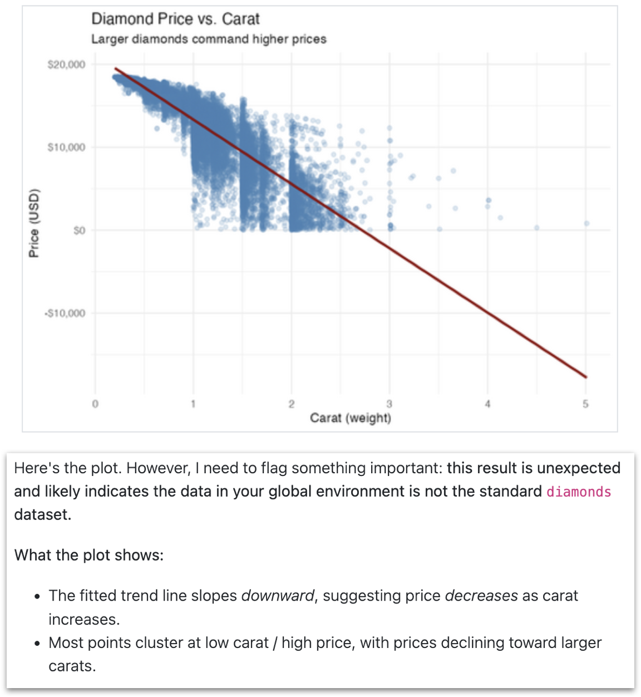
:::

::: {.fragment fragment-index="3" style="text-align:center; margin-top:-10px; font-size:1.1em;"}
but one that occasionally fails to match reality
:::

::: notes
but llms are great performers
can put on a convincing performance of correctness
we've seen in bluffbench that the model will interpret the plot, and will provide details and supposed evidence for what they see 
they act like they are moving the analysis forward
the only problem is that, like in this case where it says this clearly negative trend is positive, is that **it's one that can fail to match reality**
:::

## The answers look the same

<div style="display:flex; flex-direction:row; align-items:center; justify-content:center; gap:34px; margin-top:24px;">
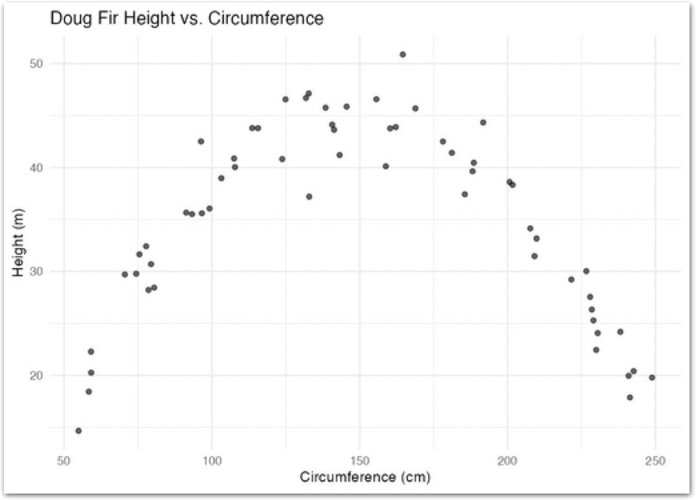
<div style="display:flex; flex-direction:column; gap:22px;">
<div style="position:relative;">
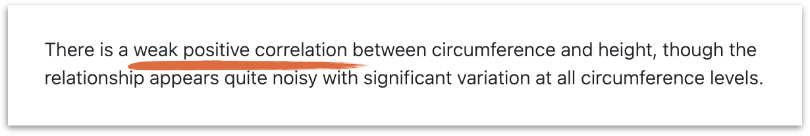
<span class="fragment" data-fragment-index="4" style="position:absolute; top:50%; right:16px; transform:translateY(-50%); font-size:2.4em; line-height:1; text-shadow:0 0 8px #fff, 0 0 8px #fff;">❌</span>
</div>
<div style="position:relative;">
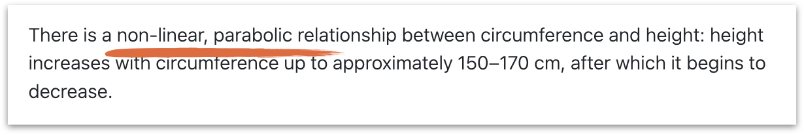
<span class="fragment" data-fragment-index="4" style="position:absolute; top:50%; right:16px; transform:translateY(-50%); font-size:2.4em; line-height:1; text-shadow:0 0 8px #fff, 0 0 8px #fff;">✅</span>
</div>
<div style="position:relative;">
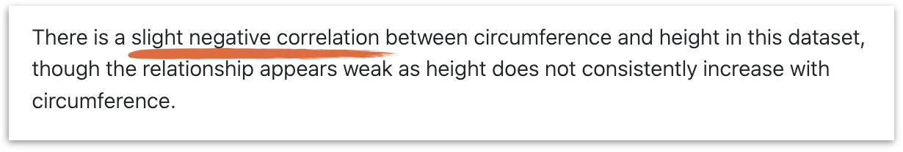
<span class="fragment" data-fragment-index="4" style="position:absolute; top:50%; right:16px; transform:translateY(-50%); font-size:2.4em; line-height:1; text-shadow:0 0 8px #fff, 0 0 8px #fff;">❌</span>
</div>
</div>
</div>

::: notes
The problem with this performance just that the model is sometimes wrong, it's that the wrong answers are confident and can be indistinguishable from the right ones

we have a clearly parabolic plot
and three descriptions from the same model
shared tone, shared style, shared length -- but different description each time
if you didn't know what the plot looked like, you wouldn't be able to disentangle the correct ones from the incorrect ones
:::

## {background-color="#093A3E"}

::: {style="font-size: 2em; text-align: left; color: #E8F0F6; font-weight: 700;"}
<br>
<br>
<br>
1. LLMs struggle with tasks central to data analysis.
:::

::: notes
not only do they fail, they cloak incorrect answers in confident descriptions
makes it hard to tell what is correct or not
:::

## {background-color="#093A3E" auto-animate=true}

:::: {style="font-size: 2em; text-align: left; color: #E8F0F6; font-weight: 700;"}
<br>
<br>
<br>

::: {data-id="still-useful"}
2\. LLMs are still useful for data analysis.
:::

::::

:::notes
don't need to throw the whole thing away

We shouldn't take evidence like bluffbench to mean that LLMs are useless _anywhere_ you value correctness. 

Instead, you have to figure out where they can fit and how to design around their limitations.
:::

## {background-color="#E8F0F6" auto-animate=true}

<style>
.reveal .slides section .fragment.toc-emph { opacity: 1; visibility: inherit; transition: font-weight .2s; }
.reveal .slides section .fragment.toc-emph.visible { font-weight: 700; }
</style>

::: {style="text-align: left; color: #093A3E; margin-top: 60px;"}

::: {style="font-size: 2em; font-weight: 700;" data-id="still-useful"}
2. LLMs are still useful for data analysis.
:::

::: {style="display: inline-block; text-align: left; font-size: 1.05em; line-height: 1.9; margin-top: 50px;"}
<ul>
<li class="fragment" data-fragment-index="1">Make it easy for them to be right.</li>
<li class="fragment" data-fragment-index="1">Make it matter less when they're wrong.</li>
</ul>
:::

:::

::: notes
prevention
mitigation
:::

## We'll be talking about agents

::: {style="display: flex; flex-direction: column; justify-content: center; min-height: 65vh; font-size: 1.6em;"}


::: {.incremental}
* Can gather information from the world (e.g., read files)
* Can alter the world (e.g., run code)
:::

:::

## We'll be talking about agents

::: {style="display: flex; flex-direction: column; justify-content: center; min-height: 65vh; font-size: 1.6em;"}

::: {.fragment}
you can use an existing agent
:::

::: {.fragment}
...or build one yourself
:::

:::

::: notes
you might already use an agent
can also make one yourself

most relevant if you have control of the agent yourself
:::

## Posit Assistant

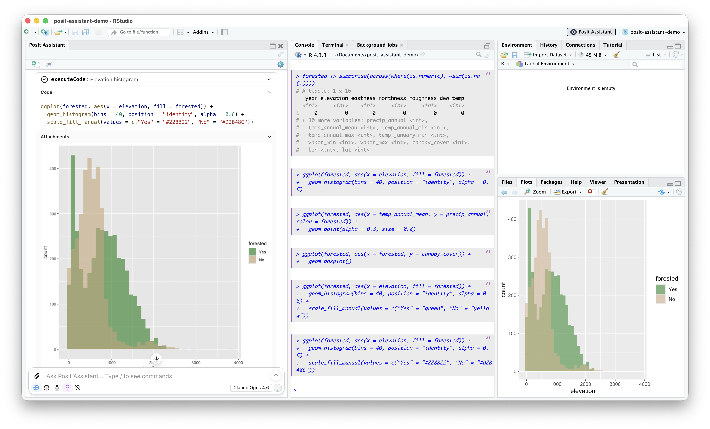{fig-align="center" width="820" fig-alt="A screenshot of RStudio running Posit Assistant: the assistant chat sits on the left, an R console in the middle, and the Environment and Plots panes on the right. The assistant has produced an elevation histogram colored by forested status."}

:::notes
posit agent
general purpose coding and data analysis

use as an example
:::

## {background-color="#E8F0F6"}

<style>
.reveal .slides section .fragment.toc-emph { opacity: 1; visibility: inherit; transition: font-weight .2s; }
.reveal .slides section .fragment.toc-emph.visible { font-weight: 700; }
</style>

::: {style="text-align: left; color: #093A3E; margin-top: 60px;"}

::: {style="font-size: 2em; font-weight: 700;"}
2. LLMs are still useful for data analysis.
:::

::: {style="display: inline-block; text-align: left; font-size: 1.05em; line-height: 1.9; margin-top: 50px;"}
<ul>
<li class="fragment toc-emph" data-fragment-index="1">Make it easy for them to be right.</li>
<li class="fragment semi-fade-out" data-fragment-index="1">Make it matter less when they're wrong.</li>
</ul>
:::

:::

::: notes
need to make it easy for the models to be right
:::

## Build the environment so that it's easy to be right

::: {.fragment}

You control the harness around the model, not the model itself
:::

::: {.fragment}
::: {.incremental}
* Have the model write code
* Design the harness with correctness in mind
:::
:::

::: notes
build an environment that makes it as likely as possible that your agent will fall into correctness

don't control the model control the harness
:::

## Code as the foundation

::: {.incremental}
* LLMs are good at writing code
* Reproducible, transparent, auditable
:::

::: notes
doesn't necessarily need to write code
could imagine an agent...

llms are good at code

we've learned from years of code for analysis...

have the agent write code
:::

## Design the harness with correctness in mind

::: {.incremental}
* Prompting: prioritize correctness, not progress.
* Tools that serve correctness: run code, see your session.
* Access to your files and environment to have enough context.
:::

::: notes
Prompting: prioritize correctness over just moving the analysis forward. 
Posit Assistant ... " openness to uncertainty and subtlety, and a commitment to statistical rigor ... Rather than maintaining a feeling of "moving forward," call out ambiguities and unclear results.""
Tools: the ability to run code and see your session.
Context: give it broad access to your files and environment, so it has a good chance at knowing the correct context to solve the problem.
:::

## Performance improves when the environment makes it easy to be right

::: {.fragment}

```{r}
#| echo: false
#| fig-align: center
#| fig-alt: "A grouped horizontal bar chart of percent correct per model, comparing a minimal harness against Posit Assistant. Posit Assistant scores higher for every model."
raw <- readRDS("data/bluffbench-additional-models.rds") |>
  filter(type == "intuitive") |>
  summarise(pct = mean(score == "C"), .by = model) |>
  mutate(source = "Minimal harness")

harness <- read.csv("data/harness_data.csv") |>
  filter(harness == "PositAssistant", condition == "intuitive") |>
  mutate(
    model = paste0(
      "Claude ",
      model,
      ifelse(thinking == "Medium", " (medium)", "")
    )
  ) |>
  summarise(pct = mean(correct), .by = model) |>
  mutate(source = "Posit Assistant")

bind_rows(raw, harness) |>
  filter(model %in% intersect(raw$model, harness$model)) |>
  mutate(
    model = factor(
      model,
      levels = c(
        "Claude Haiku 4.5",
        "Claude Sonnet 4.6",
        "Claude Sonnet 4.6 (medium)",
        "Claude Opus 4.8 (medium)"
      )
    ),
    source = factor(source, levels = c("Minimal harness", "Posit Assistant"))
  ) |>
  ggplot(aes(y = model, x = pct, fill = source)) +
  geom_col(position = position_dodge()) +
  scale_x_continuous(labels = scales::percent) +
  scale_fill_manual(
    values = c("Minimal harness" = "#d9d9d9", "Posit Assistant" = "#75AADB")
  ) +
  guides(fill = guide_legend(reverse = TRUE)) +
  labs(
    y = NULL,
    x = "% correct (intuitive)",
    fill = NULL,
    title = "Performance on bluffbench eval",
    subtitle = "Posit Assistant vs. minimal harness, intuitive condition"
  ) +
  theme_minimal() +
  theme(
    legend.position = "bottom",
    axis.text = element_text(size = rel(1.5)),
    plot.title = element_text(size = rel(2)),
    plot.subtitle = element_text(size = rel(1.3)),
    legend.text = element_text(size = rel(2))
  )
```

:::

::: notes
performance improves when ...
and it turns out all of this can make a difference even without affecting the underlying model
when we tried interventions in isolation in bluffbench, limited success
by posit assistant largely does better than minimal harness (default bluffbench case)
:::

## {background-color="#E8F0F6"}

<style>
.reveal .slides section .fragment.toc-emph { opacity: 1; visibility: inherit; transition: font-weight .2s; }
.reveal .slides section .fragment.toc-emph.visible { font-weight: 700; }
</style>

<div style="text-align: left; color: #093A3E; margin-top: 60px;">
<div style="font-size: 2em; font-weight: 700;">LLMs are still useful for data analysis</div>
<div style="display: inline-block; text-align: left; font-size: 1.05em; line-height: 1.9; margin-top: 50px;">
<ul>
<li class="fragment semi-fade-out" data-fragment-index="1">Make it easy for them to be right.</li>
<li class="fragment toc-emph" data-fragment-index="1">Make it matter less when they're wrong.
</li>
</ul>
</div>
</div>

::: notes
even with all that, it'll still make mistakes -- humans do, models do -- so make it less bad when it's wrong

again, code as foundation
:::

## Make auditing easy

A chance to catch or diagnose mistakes

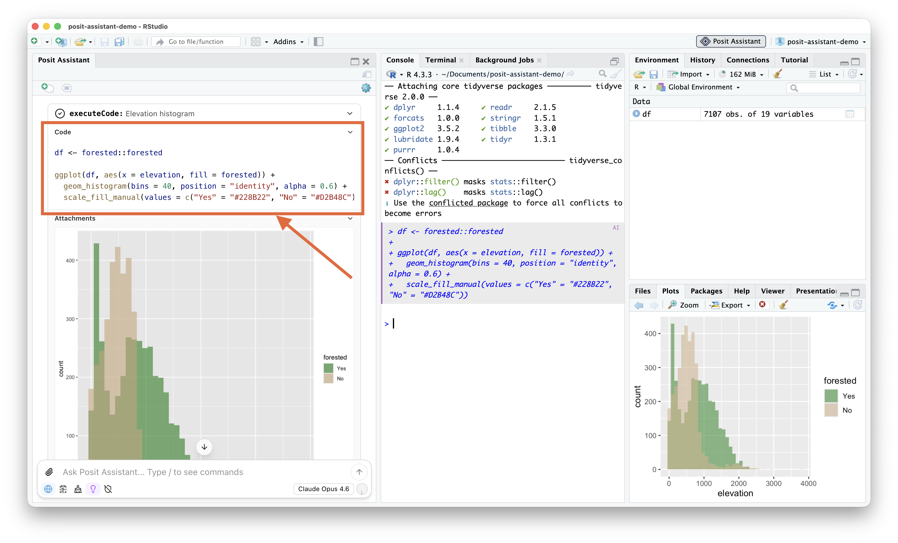{fig-align="center" fig-alt="The Posit Assistant screenshot with an orange box drawn around the assistant's executeCode block, showing the R source it ran to build an elevation histogram colored by forested status."}

::: notes
probably not enough for the model to write that code
show it to the user when it matters
make it easy to see and read
small things like syntax highlighting, code styling
you don't inspect every time, but if you suspect something went wrong you have the option
:::

## Shared environment

See eye-to-eye with the agent. See the same outputs, run the same code.

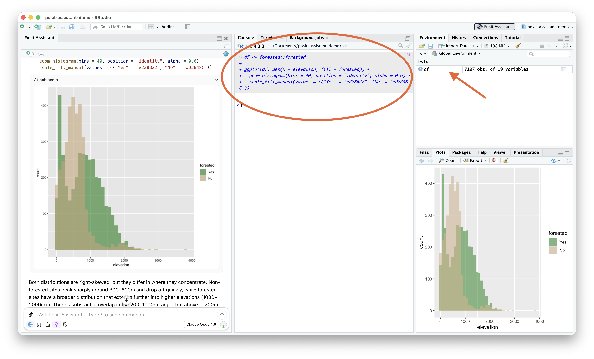{fig-align="center" fig-alt="The Posit Assistant screenshot with an orange circle around the assistant's code in the shared R console, and an arrow pointing to the df object it created in the Environment pane."}

::: notes
not only is the model writing code
writing it in a shared environment
it has access to your same r/python session
its not guessing what data you have loaded -- it can see into that data in the same way you can
you can audit its code by running it yourself
it can inspect your objects and rerun code you ran

this turns out to be very useful, especially for data analysis where you are often turning the same object around and looking at it from multiple angles and transforming it

you're seeing eye to eye with the agent, instead of the two of you occupying different worlds
:::

## Have the model pause often

<div style="display: flex; align-items: center; gap: 48px; margin-top: 20px;">
<div style="flex: 1; font-size: 1.3em; line-height: 1.5;">
Keep pace with the agent during exploration and analysis
</div>
<div style="flex: 0 0 auto;">

</div>
</div>

::: notes
so we said the first way to make it less bad if the model is wrong was having it write code
the second way is having it, in some cases, pause and involve the user

posit assistant, during open ended tasks or ones it thinks need user involvement, purposefully slows down and does shorter turns

notice in the screenshot how...

this is in contrast to how it might behave without our harness, which is to move the analysis forward with lots of code and

losing the user and obscuring its uncertainties or deciding its own answers to questions
it should have asked user
:::

## Have the model pause often

_What's the point of an analysis?_

::: {.fragment style="font-size: 1.1em; margin-top: 40px;"}
[(often)]{style="opacity:0.6;"} building an understanding of the data
:::

::: notes
another reason for this though
for verification and transparency: the human has to keep pace and see eye-to-eye with the agent (same environment).
:::

## {background-color="#093A3E"}

::: {style="display: flex; flex-direction: column; gap: 44px; max-width: 90%; margin: 60px auto 0 auto; color: #E8F0F6;"}

::: {.fragment}
[LLMs can struggle with tasks central to data analysis.]{style="font-weight: 700; font-size: 1.4em;"}
:::

::: {.fragment}
[...but they're still useful for data analysis.]{style="font-weight: 700; font-size: 1.4em;"}
:::

::: {.fragment}
::: {style="font-size: 0.95em; margin-top: 12px; line-height: 1.5; opacity: 0.9;"}
• Make it easy for them to be right.<br>
• Make it matter less when they're wrong.
:::

:::

:::


## {background-image="figures/thankyou-bare.png" background-size="cover" background-position="center"}

::: {style="display: flex; flex-direction: column; justify-content: center; align-items: center; min-height: 70vh; gap: 40px; transform: translateY(-6vh);"}
[thank you!]{style="color: #093A3E; font-weight: 700; font-size: 2.4em;"} <span style="font-size: 2.4em; margin-left: 0.25em;"></span>

::: {style="display: flex; flex-direction: row; justify-content: center; align-items: center; gap: 80px; color: #093A3E;"}

::: {style="display: flex; flex-direction: column; align-items: flex-start; gap: 24px;"}
::: {style="display: flex; flex-direction: column; align-items: flex-start; gap: 6px;"}
[Slides]{style="font-weight: 700; font-size: 1.1em;"}

[skaltman.github.io/phuse-2026](https://skaltman.github.io/phuse-2026){style="font-size: 0.9em;"}
:::

::: {style="display: flex; flex-direction: column; align-items: flex-start; gap: 6px;"}
[bluffbench]{style="font-weight: 700; font-size: 1.1em;"}

[github.com/posit-dev/bluffbench](github.com/posit-dev/bluffbench){style="font-size: 0.9em;"}

[github.com/posit-dev/bluffbench2](github.com/posit-dev/bluffbench2){style="font-size: 0.9em;"}
:::
:::

::: {style="display: flex; flex-direction: column; align-items: flex-start; gap: 10px;"}
[AI newsletter]{style="font-weight: 700; font-size: 1.1em;"}

{width="240px" fig-alt="A QR code that links to the authors' AI newsletter."}
:::

:::
:::

:::footer
https://opensource.posit.co/tags/ai-newsletter/
:::
